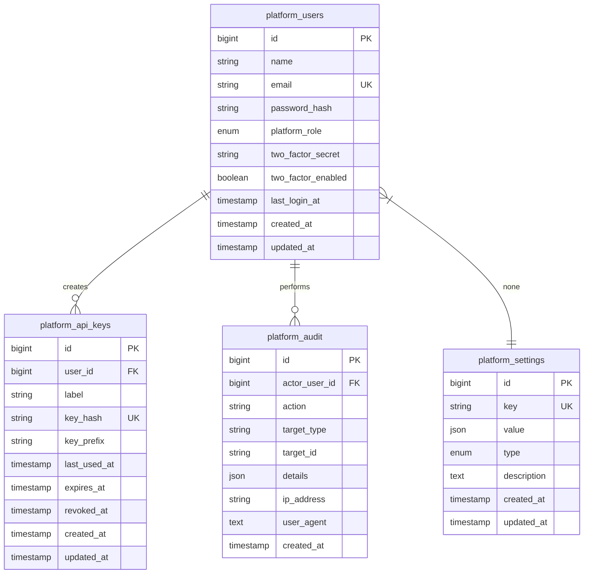

# Data Model: Admin Platform Console

**Feature**: 040-admin-console  
**Date**: 2026-04-21  
**Status**: Draft

## Database Schema (New Tables)

### platform_users

| Column | Type | Constraints | Notes |
|--------|------|-------------|-------|
| id | BIGINT UNSIGNED | PK, AUTO_INCREMENT | |
| name | VARCHAR(255) | NOT NULL | Full name |
| email | VARCHAR(255) | NOT NULL, UNIQUE | Login email |
| password_hash | VARCHAR(255) | NOT NULL | CodeIgniter Password::hash() |
| platform_role | ENUM('Owner','Admin','Finance','Support') | NOT NULL | |
| two_factor_secret | VARCHAR(255) | NULL | TOTP secret; NULL = 2FA disabled |
| two_factor_enabled | BOOLEAN | NOT NULL DEFAULT FALSE | Computed flag |
| last_login_at | TIMESTAMP | NULL | Updated on successful login |
| created_at | TIMESTAMP | NOT NULL DEFAULT CURRENT_TIMESTAMP | |
| updated_at | TIMESTAMP | NOT NULL DEFAULT CURRENT_TIMESTAMP ON UPDATE CURRENT_TIMESTAMP | |

**Indexes**: UNIQUE KEY (email), INDEX (platform_role)

**Validation rules**:
- email: valid email format
- platform_role: must be one of defined enum values
- password_hash: never null; never expose in responses

### platform_settings

| Column | Type | Constraints | Notes |
|--------|------|-------------|-------|
| id | BIGINT UNSIGNED | PK, AUTO_INCREMENT | |
| `key` | VARCHAR(255) | NOT NULL, UNIQUE | Setting identifier |
| value | JSON | NOT NULL | Setting value; can be string/number/boolean/object |
| type | ENUM('string','number','boolean','json') | NOT NULL | For casting/validation |
| description | TEXT | NULL | Human-readable description |
| created_at | TIMESTAMP | NOT NULL DEFAULT CURRENT_TIMESTAMP | |
| updated_at | TIMESTAMP | NOT NULL DEFAULT CURRENT_TIMESTAMP ON UPDATE CURRENT_TIMESTAMP | |

**Indexes**: UNIQUE KEY (`key`), INDEX (type)

**Validation rules**:
- `key`: alphanumeric/dash/underscore; max 255 chars
- value: valid JSON; structure validated against type
- type: must match actual value type

**Known keys** (to be seeded):
- `platform_name` (string)
- `support_email` (string)
- `default_currency` (string, 3-char)
- `default_timezone` (string)
- `tagline` (string)
- `tax_rate` (number, decimal)
- `trial_length_days` (number)
- `invoice_prefix` (string)
- `payment_provider_status` (json)
- `email_template_welcome` (json)
- `email_template_trial_ending` (json)
- `email_template_payment_failed` (json)
- `email_template_subscription_cancelled` (json)
- `email_template_monthly_invoice` (json)
- `enforce_2fa` (boolean)
- `enforce_sso` (boolean)
- `auto_suspend_after_failed_payments` (number)
- `weekly_security_digest` (boolean)

### platform_api_keys

| Column | Type | Constraints | Notes |
|--------|------|-------------|-------|
| id | BIGINT UNSIGNED | PK, AUTO_INCREMENT | |
| user_id | BIGINT UNSIGNED | NOT NULL, FK → platform_users(id) | Creator |
| label | VARCHAR(255) | NOT NULL | Human-readable label |
| key_hash | VARCHAR(255) | NOT NULL, UNIQUE | SHA-256 hash of the key |
| key_prefix | VARCHAR(16) | NOT NULL | First 8 chars for identification |
| last_used_at | TIMESTAMP | NULL | Updated on each successful use |
| expires_at | TIMESTAMP | NULL | Optional expiration |
| revoked_at | TIMESTAMP | NULL | NULL = active |
| created_at | TIMESTAMP | NOT NULL DEFAULT CURRENT_TIMESTAMP | |
| updated_at | TIMESTAMP | NOT NULL DEFAULT CURRENT_TIMESTAMP ON UPDATE CURRENT_TIMESTAMP | |

**Indexes**: UNIQUE KEY (key_hash), INDEX (user_id), INDEX (revoked_at)

**Validation rules**:
- label: required; max 255 chars
- key_hash: SHA-256 of raw key; never expose raw key
- key_prefix: first 8 chars of raw key; for display

### platform_audit

| Column | Type | Constraints | Notes |
|--------|------|-------------|-------|
| id | BIGINT UNSIGNED | PK, AUTO_INCREMENT | |
| actor_user_id | BIGINT UNSIGNED | NULL, FK → platform_users(id) | NULL = system |
| action | VARCHAR(255) | NOT NULL | Action identifier |
| target_type | VARCHAR(100) | NULL | Entity type (tenant/plan/subscription/user/setting) |
| target_id | VARCHAR(100) | NULL | Entity identifier |
| details | JSON | NULL | Additional context |
| ip_address | VARCHAR(45) | NULL | IPv4/IPv6 |
| user_agent | TEXT | NULL | |
| created_at | TIMESTAMP | NOT NULL DEFAULT CURRENT_TIMESTAMP | |

**Indexes**: INDEX (actor_user_id), INDEX (action), INDEX (target_type, target_id), INDEX (created_at)

**Validation rules**:
- action: required; max 255 chars
- target_type + target_id: both null or both present
- details: valid JSON; free-form

## Entity Relationships

## Data Access Patterns

### PlatformUser Model
- Methods: `findById()`, `findByEmail()`, `create()`, `updateLastLogin()`, `enable2FA()`, `disable2FA()`
- Scopes: `active()`, `byRole()`
- Relationships: `apiKeys`, `auditEntries`

### PlatformSetting Model
- Methods: `get($key)`, `set($key, $value, $type)`, `getAll()`, `getByType()`
- Static cache for frequently accessed settings
- Type casting in getters/setters

### PlatformApiKey Model
- Methods: `create()`, `revoke()`, `updateLastUsed()`, `verifyKey($rawKey)`
- Never expose raw key after creation
- Scope: `active()`

### PlatformAudit Model
- Methods: `log()`, `findByActor()`, `findByTarget()`, `recent()`
- Static method for quick logging: `PlatformAudit::log($action, $target, $details)`

## Security Considerations

- **Password hashing**: Use CodeIgniter's `Password::hash()` with default algorithm (Argon2id if available)
- **API keys**: Store only SHA-256 hash; raw key shown only once at creation
- **2FA secrets**: Encrypt at rest using CodeIgniter's encryption if database is compromised
- **Audit immutability**: No UPDATE or DELETE on audit records
- **Rate limiting**: Apply to login and impersonation endpoints (not in schema, implemented in controllers)

## Migration Dependencies

New tables are independent; can be created in any order. Recommended order:
1. platform_users
2. platform_settings
3. platform_api_keys
4. platform_audit

Seed data should include:
- Default platform settings
- Initial platform admin user (Owner role)
